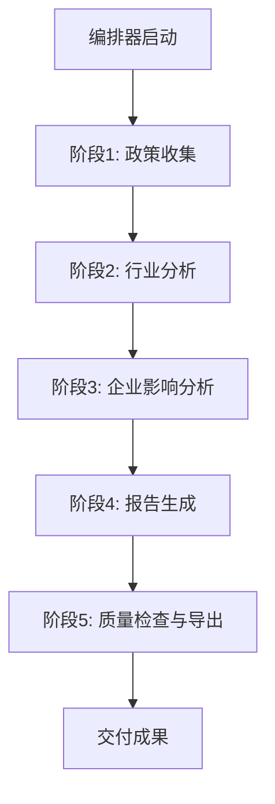

# 宏观政策研究多智能体系统

## 项目概述

本系统是一个基于POMASA（Pattern-Oriented Multi-Agent System Architecture）架构的政策研究系统，专门用于分析宏观政治经济政策对汽车行业及德赛西威的影响。

### 研究目标

1. **政策层面**：深入研究十五五规划和中央经济工作会议，理解国家层面政治政策、经济的未来趋势
2. **行业层面**：分析这些政策趋势对汽车行业的影响
3. **企业层面**：研究政策和行业趋势对德赛西威（Desay SV）的具体影响

## 系统架构

### Agent结构

```
agents/
├── 00.orchestrator.md           # 编排器：协调整个研究流程
├── 01.policy_researcher.md      # 政策研究员：收集政策材料
├── 02.industry_analyzer.md      # 行业分析师：分析行业影响
├── 03.company_impact_analyzer.md # 企业影响分析师：分析对德赛西威的影响
└── 04.report_generator.md       # 报告生成器：生成综合报告
```

### 采用的POMASA模式

#### 必需模式
- **COR-01**: 提示定义的Agent - 使用自然语言蓝图定义Agent行为
- **COR-02**: 智能运行时 - 具备理解和决策能力的运行环境
- **STR-01**: 参考数据配置 - 将领域知识外部化为独立配置
- **BHV-02**: 忠实Agent实例化 - 确保Agent严格按照蓝图执行
- **QUA-03**: 可验证的数据血统 - 端到端可追溯的数据来源

#### 质量保证模式（标准级别）
- **QUA-01**: 嵌入式质量标准 - 在Agent蓝图中嵌入质量标准
- **BHV-05**: 基于原文的网络研究 - 获取原始网页内容而非依赖搜索摘要

#### 其他推荐模式
- **BHV-01**: 编排的Agent流水线 - 多Agent分阶段协作
- **STR-02**: 文件系统数据总线 - 使用文件系统传递数据
- **STR-03**: 工作空间隔离 - Agent在指定目录内工作
- **STR-04**: 业务驱动的Agent设计 - 按业务流程划分Agent
- **STR-05**: 可组合文档装配 - 分段生成长文档
- **STR-06**: 方法论指导 - 提供研究方法指导
- **STR-08**: Pandoc就绪的Markdown格式 - 确保正确转换为DOCX/PDF
- **STR-09**: 可交付物导出流水线 - 导出最终报告为多种格式

## 使用指南

### 前置要求

1. **运行环境**：需要支持POMASA架构的智能运行时（如Claude、GPT-4等）
2. **导出工具**（可选，用于生成DOCX/PDF）：
   - pandoc：文档转换工具
   - XeLaTeX：PDF生成（支持中文）

### 快速开始

#### 步骤1：启动编排器

```
请阅读 agents/00.orchestrator.md 并按照其指示执行整个研究流程
```

编排器将自动：
1. 初始化系统
2. 依次启动各个专业Agent
3. 协调数据在各阶段间的流转
4. 监控执行状态
5. 生成最终报告

#### 步骤2：监控执行

查看 `wip/notes.md` 了解执行进度和遇到的问题。

#### 步骤3：查看结果

研究完成后，在以下位置查看结果：
- `data/04.reports/final_report.md` - 完整研究报告
- `data/04.reports/executive_summary.md` - 高管摘要

#### 步骤4：导出报告（可选）

```bash
cd policy_research
bash scripts/export.sh
```

导出的文件将保存在 `_output/` 目录，包括：
- DOCX格式（便于编辑）
- PDF格式（便于分发）

### 执行流程详解



1. **阶段1 - 政策收集**：
   - Agent：政策研究员
   - 任务：收集十五五规划、中央经济工作会议材料
   - 输出：`data/01.policy_materials/`

2. **阶段2 - 行业分析**：
   - Agent：行业分析师
   - 任务：分析政策对汽车行业的影响
   - 输出：`data/02.industry_analysis/`

3. **阶段3 - 企业影响分析**：
   - Agent：企业影响分析师
   - 任务：分析对德赛西威的具体影响
   - 输出：`data/03.company_impact/`

4. **阶段4 - 报告生成**：
   - Agent：报告生成器
   - 任务：整合分析结果，生成研究报告
   - 输出：`data/04.reports/`

5. **阶段5 - 质量检查与导出**：
   - 检查报告质量
   - 导出为DOCX和PDF格式

## 目录结构

```
policy_research/
├── agents/                  # Agent蓝图
│   ├── 00.orchestrator.md
│   ├── 01.policy_researcher.md
│   ├── 02.industry_analyzer.md
│   ├── 03.company_impact_analyzer.md
│   └── 04.report_generator.md
├── references/              # 参考数据
│   ├── domain/             # 领域知识
│   │   └── automotive_industry.md
│   └── methodology/        # 方法论指导
│       └── research_methods.md
├── scripts/                # 工具脚本
│   ├── export.sh          # 导出脚本
│   └── latex-header.tex   # PDF中文支持
├── data/                   # 运行时数据（由Agent生成）
│   ├── 01.policy_materials/
│   ├── 02.industry_analysis/
│   ├── 03.company_impact/
│   └── 04.reports/
├── _output/               # 导出的报告（DOCX/PDF）
├── wip/                   # 工作进展
│   └── notes.md          # 执行笔记
└── README.md             # 本文档
```

## 质量保证

### 数据可靠性

- **原文获取**：使用WebFetch获取原始网页内容，不依赖搜索摘要
- **多源验证**：重要信息从多个权威来源交叉验证
- **来源追溯**：所有数据标注明确来源和获取时间

### 分析严密性

- **逻辑完整**：确保因果关系清晰，论据充分
- **客观平衡**：展示机遇和挑战，避免片面性
- **可操作性**：提供具体可行的战略建议

### 输出规范性

- **结构清晰**：采用标准报告结构
- **格式统一**：遵循Pandoc就绪的Markdown格式
- **多格式支持**：可导出为DOCX和PDF

## 自定义配置

### 修改研究重点

编辑相应的Agent蓝图文件，调整研究重点。例如：
- 关注特定政策：修改 `01.policy_researcher.md`
- 调整分析维度：修改 `02.industry_analyzer.md`
- 更换目标企业：修改 `03.company_impact_analyzer.md`

### 添加领域知识

在 `references/domain/` 目录下添加更多领域知识文件，供Agent参考。

### 调整方法论

修改 `references/methodology/research_methods.md` 以采用不同的分析框架。

## 故障排除

### 常见问题

1. **Agent执行失败**
   - 检查 `wip/notes.md` 中的错误日志
   - 确认网络连接正常
   - 验证输入数据完整性

2. **导出失败**
   - 确认已安装pandoc
   - 检查Markdown格式是否规范
   - 查看脚本输出的错误信息

3. **中文显示问题**
   - PDF：确认已安装中文字体和XeLaTeX
   - DOCX：使用支持中文的Office软件打开

### 获取帮助

- 查看POMASA模式文档：`pattern-catalog/`
- 参考系统设计文档：`generator.md`
- 提交问题：[项目Issue页面]

## 最佳实践

1. **定期保存进度**：重要阶段完成后备份data目录
2. **人工审核**：AI生成的内容需要人工审核和调整
3. **持续更新**：政策动态变化，定期重新运行获取最新信息
4. **知识积累**：有价值的分析结果可添加到references供后续使用

## 版本信息

- 系统版本：1.0.0
- 基于POMASA：v0.8
- 创建日期：2025年1月
- 最后更新：2025年1月

## 许可和声明

本系统基于POMASA架构构建，仅供研究和分析使用。生成的报告内容仅供参考，不构成投资或业务决策建议。